# vote-app

Le but est de Mise en place d'une solution de vote basée sur une application serverless et une solution de type app engine . On aura besoin de deux fonctions Servless :

1. Affiche la liste des candidats
2. Fait la collecte des votes

Ces applications fourniront des données à une application app engine, qui pourra être couplée à une base de donnée.

# Implementation

Nous commencons par écrire deux lambda fonctions une pour lire les données de la base
de données et une autre pour écrire des données sur la base de données DynamoDB, et puis
on a utilisé des rôles IAM qui vas nous permet de faire une communication entre la base de
donnée et lambda fonction, après on a configuré api Gateway (API REST) pour que nous
puisse accéder à nos fonctions.

## Création DynamoDB

Donc la première chose que nous voulons faire c’est de passer à dynamodb et de créer une table
des utilisateurs afin que nous puissions mettre ou avoir des données dedans.

il faut juste cliquez sur le bouton créer une table et puis lui donner le nom des  utilisateurs clé de partition qui est juste un identifiant unique pour chaque entrée dans le base de données.

## Création IAM

La prochaine étape sera de créer un rôle pour donner à notre fonction lambda les autorisations
de travailler avec cette table dynamoDB.

Donc tout d’abord ils vont nous demander quel type de rôle nous voulons créer donc on va
choisir le cas d’utilisation lambda car nous voulons donnée ces rôles a notre fonction lambda.

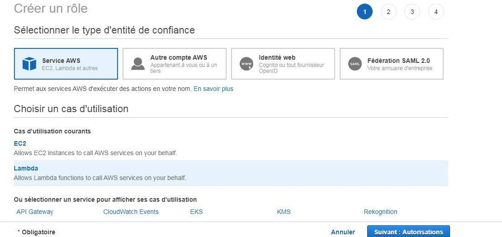

Puis on va ajouter une politique lambda à notre service :

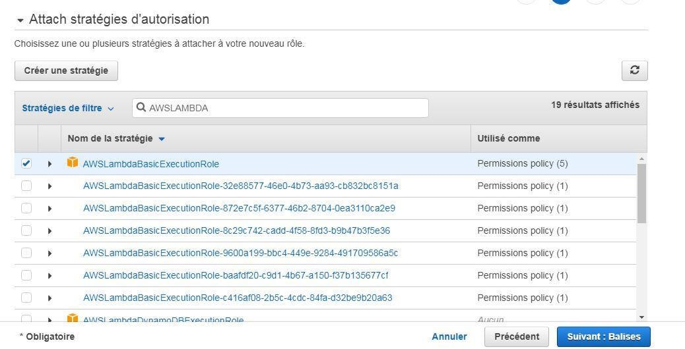

Après on donne un nom à notre rôle IAM.

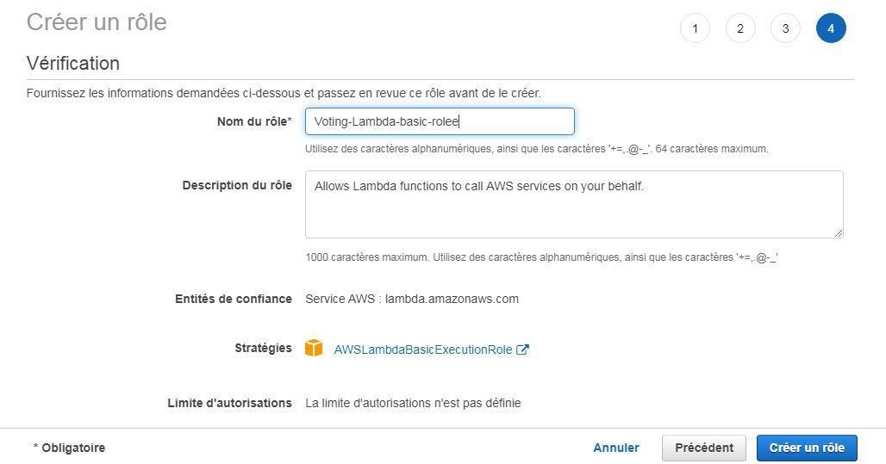

Donc ici on voit que notre rôle a était créé avec succès.

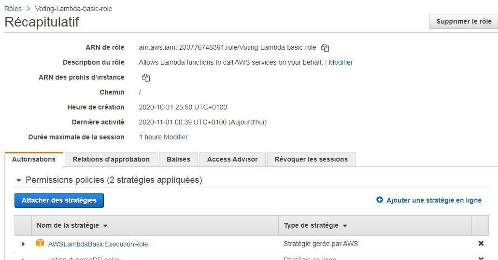

On a ajouté après une politique supplémentaire, on a ajouté des autorisations pour permettre à
cette fonction lambda d'appeler dynamoDB.

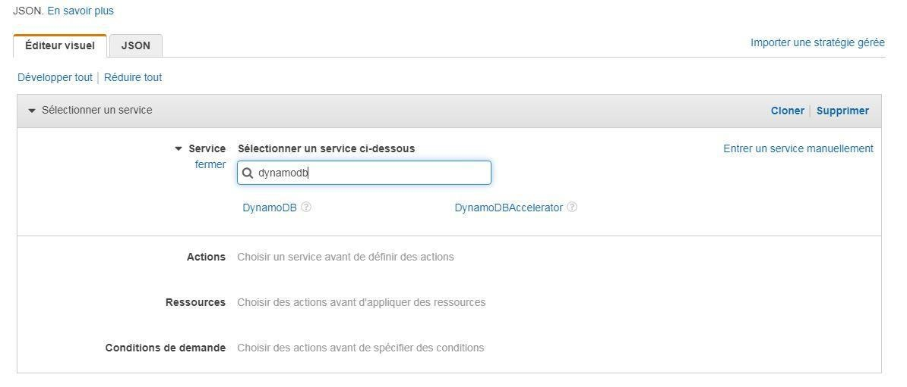

Nous avons attribué essentiellement ce rôle à nos fonctions lambda afin qu'elles puissent
accéder à la table dynamoDB.
Donc la prochaine tâche sera d'entrer et de commencer à coder du lambda .

## Création des Fonctions Lambda.

On a commencé par créer des fonctions lambda et attribué le rôle IAM aux fonctions, donc on
donne un nom à notre fonction et puis on choisit le langage souhaiter puis on attribue le rôle
qu’on a écrit.

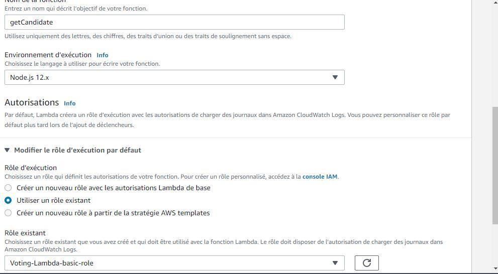

Première fonction va nous mettre des éléments sur notre base de données :

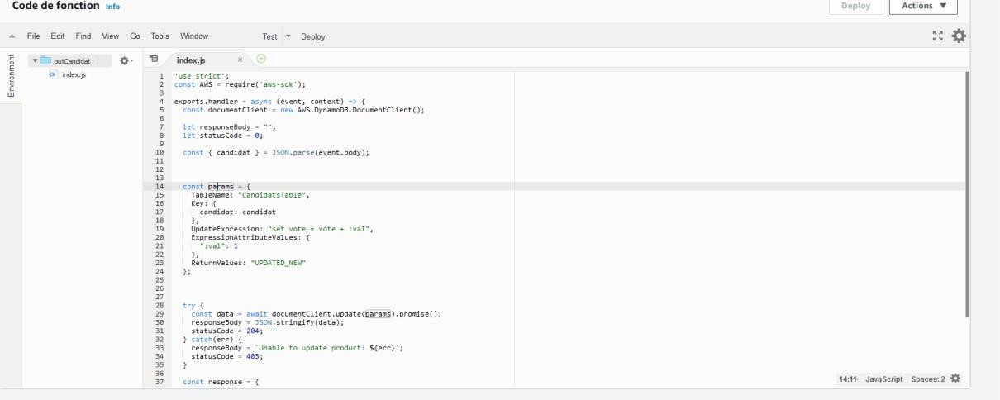

Apres on a eu pour but de faire une fonction qui récupère un élément de DynamoDB

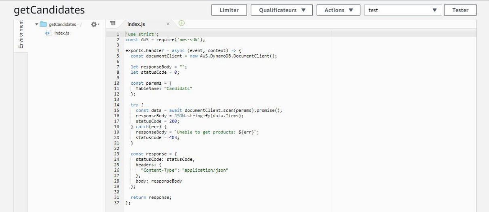

Donc quand on lance le test sur cette fonction on voit bien qu’il nous récupère les éléments
qu’on a sur la base de données, donc notre fonction lambda fonction bien :

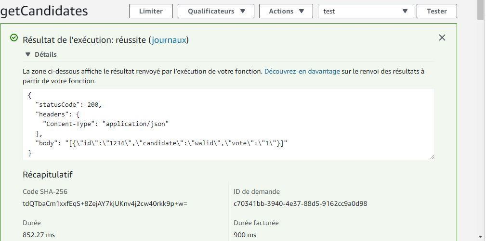

## Api Gateway

Maintenant on va passer à la création de l’api Gateway, nous utiliserons la passerelle API pour créer une API REST simple pour interagir avec nos fonctions lambda obtenir et définir données utilisateur afin que la passerelle API appelle nos fonctions lambda qui à leur tour obtiendront et définissez les données dans la base de données.

Donc on va commencer par crée l’api Gateway on cliquons sur créer une API :

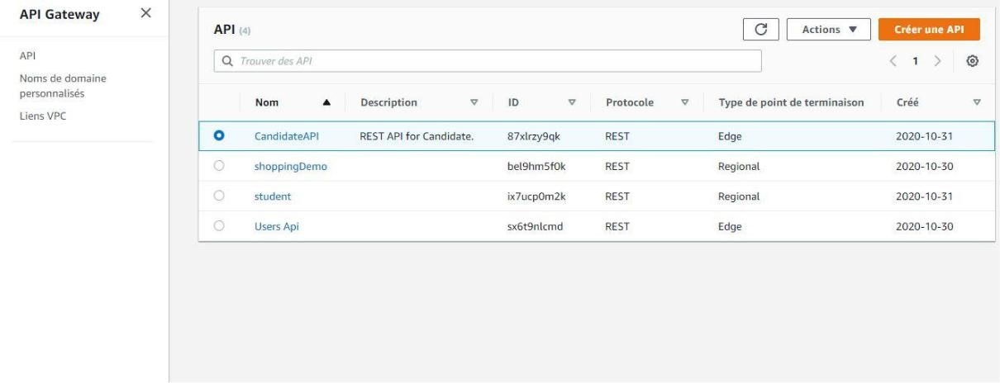

Puis on va choisir API qu’on veut utiliser :

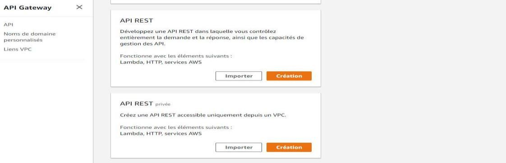

Puis on va donner un nom à notre api puis la région avec la quel on travaille sur aws.

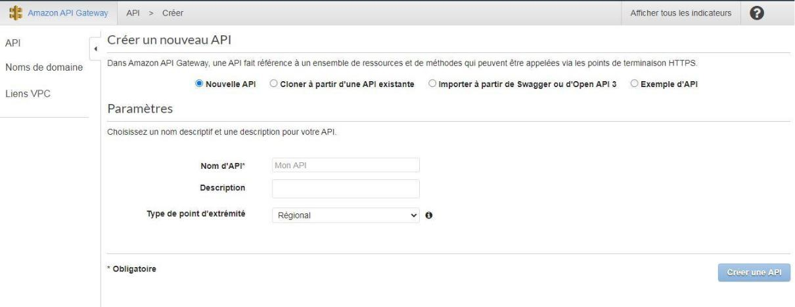

Là on voit que notre API a était crée avec succès.

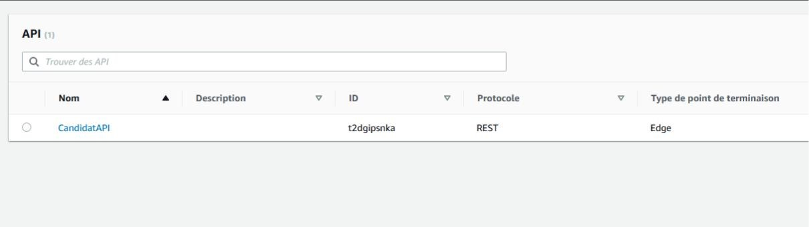

Après on a créé les ressources et les méthodes pour l’API REST

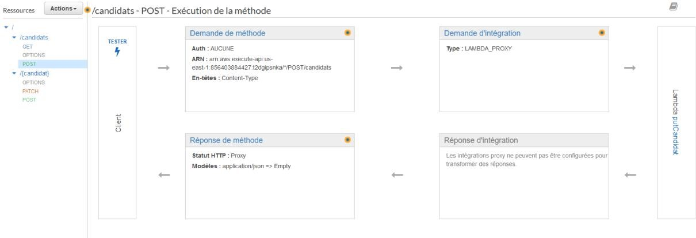

Sur la capture ci-dessous on voit bien que la communication entre l’api et les fonctions Lambda était établie.

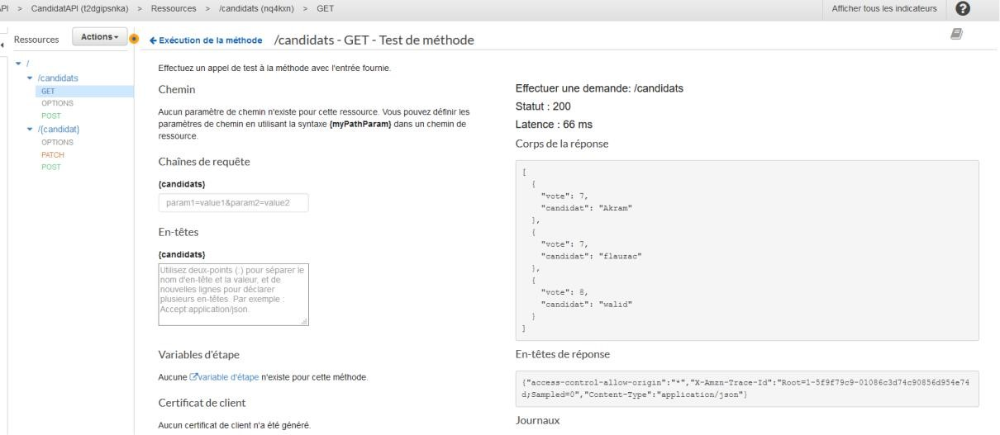

Après on a déployer notre API.

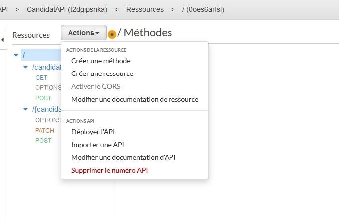

La capture ci-dessous montre que notre API était déployée successivement.

Test de API après le déploiement.

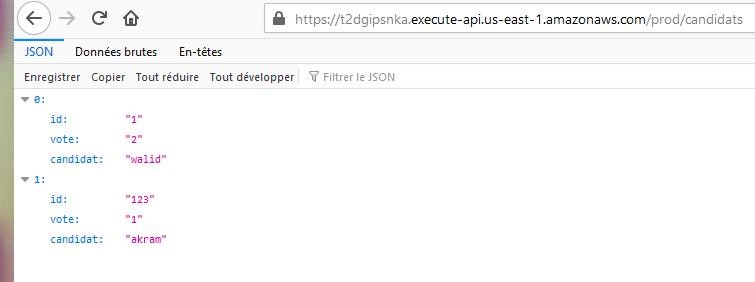
